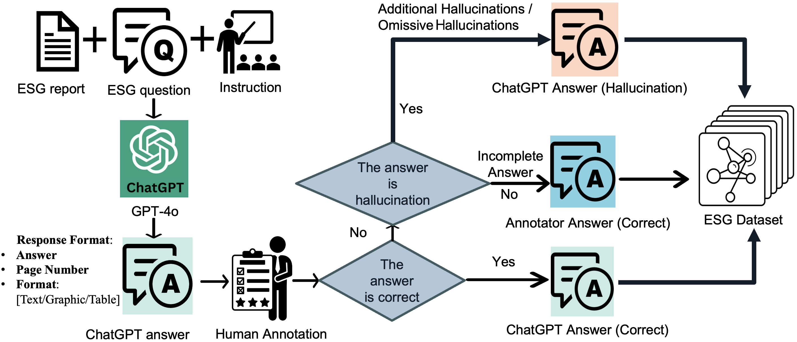

# ESG-Bench: Benchmarking Long-Context ESG Reports for Hallucination Mitigation

We present **ESG-Bench**, a benchmark for hallucination-aware question answering over long ESG (Environmental, Social, and Governance) reports, and propose task-specific Chain-of-Thought (CoT) strategies to mitigate hallucinations in large language models.

---

## News

- [2025/11/13] Our work has been accepted by **AAAI 2026**! 
  
## Overview

<p align="center">
    
</p>

**ESG-Bench** focuses on:
- Long-context ESG reports (hundreds of pages).
- Human-annotated labels for **correct**, **hallucinated**, **incomplete**, and **not-found** answers.
- A **hallucination mitigation task** with WA (With Answer) / WoA (Without Answer) labels.
- Task-specific **Chain-of-Thought** strategies that improve factual grounding and abstention.

---
## Abstract

As corporate responsibility increasingly incorporates environmental, social, and governance (ESG) criteria, ESG reporting is becoming a legal requirement in many regions and a key channel for documenting sustainability practices and assessing firms’ long-term and ethical performance. However, the length and complexity of ESG disclosures make them difficult to interpret and automate the analysis reliably. To support scalable and trustworthy analysis, this paper introduces ESG-Bench, a benchmark dataset for ESG report understanding and hallucination mitigation in large language models (LLMs). ESG-Bench contains human-annotated question–answer (QA) pairs grounded in real-world ESG report contexts, with fine-grained labels indicating whether model outputs are factually supported or hallucinated. Framing ESG report analysis as a QA task with verifiability constraints enables systematic evaluation of LLMs’ ability to extract and reason over ESG content and provides a new use case: mitigating hallucinations in socially sensitive, compliance-critical settings. We design task-specific Chain-of-Thought (CoT) prompting strategies and fine-tune multiple state-of-the-art LLMs on ESG-Bench using CoT-annotated rationales. Our experiments show that these CoT-based methods substantially outperform standard prompting and direct fine-tuning in reducing hallucinations, and that the gains transfer to existing QA benchmarks beyond the ESG domain. 

---

## Generation Pipeline

This repository includes a generation framework that supports:
- Model selection (llama, mistral, gemma)
- Dataset selection (bioasq, esghalu, halueval)
- Variant selection (before_finetune, sft, cot_2steps, cot_4steps)
- Long-context prompt construction

All experiment settings in ESG-Bench are managed through Hydra and stored in the conf/ directory.
```angular2html
conf/
├── model/
│   ├── default.yaml
├── data/
│   ├── default.yaml
├── prompt/
│   └── sentence.yaml
└── sentence_length_generation.yaml 
```

You can run generation as:

```angular2html
python generation.py
```
